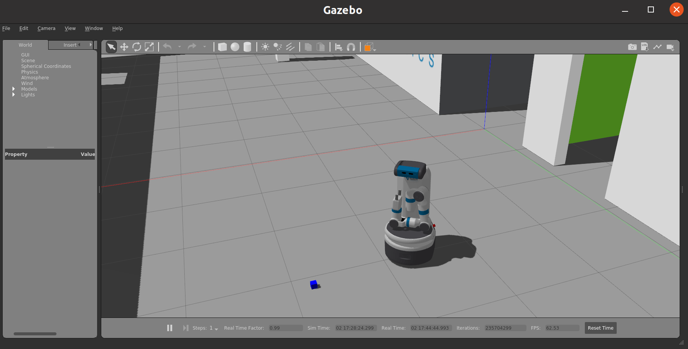

# fetch-gazebo
[参考サイト 公式ドキュメント](https://docs.fetchrobotics.com/index.html)
- procedure
  ```
  cd ./fetch-gazebo/src/
  cd ../Docker
  ./build.sh
  ./run.sh # change some arguments for each env
  ### in the container
  byobu
  source /opt/ros/melodic/setup.bash
  cd /root/catkin_ws
  roslaunch fetch_gazebo playground.launch
  #push F2
  source /opt/ros/melodic/setup.bash
  roscd fetch_test/scripts
  roslaunch fetch_gazebo_demo tests_arm_movements.launch
  ```


